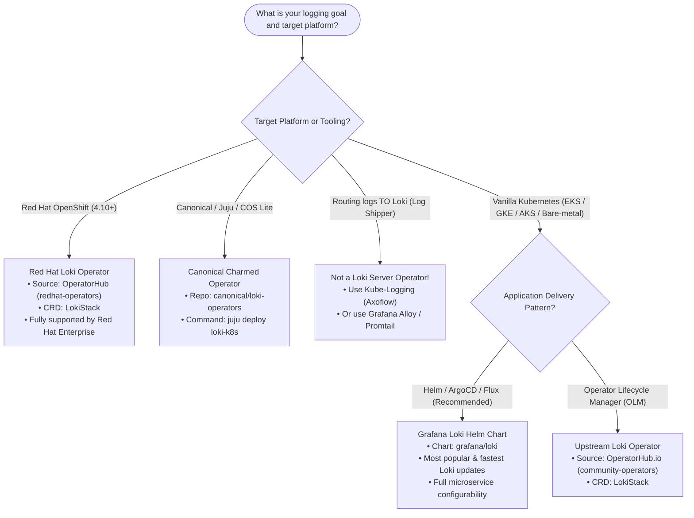

# Loki Operator Installation

Deploy Loki using the Loki Operator with `LokiStack` CRD.

## Overview

The Loki Operator manages Loki deployments using Kubernetes-native Custom Resource Definitions (CRDs). It automates deployment, scaling, and lifecycle management of Loki clusters.

## When to Use

| ✅ Good For | ❌ Not For |
|-------------|-----------|
| OpenShift environments | Quick local testing |
| GitOps workflows | Simple single-node setups |
| Automated lifecycle management | Learning Loki basics |
| Production with operator patterns | Minikube/Docker Desktop |

## Prerequisites

- Kubernetes 1.21+ or OpenShift 4.10+
- cert-manager (for webhook certificates)
- Object storage (S3, GCS, Azure Blob, or MinIO)

## Installation Methods

### 1. OpenShift (OperatorHub)

```bash
# Install via OperatorHub UI or CLI
oc apply -f openshift/subscription.yaml
```

### 2. Kubernetes (OLM)

```bash
# Install OLM first
curl -sL https://github.com/operator-framework/operator-lifecycle-manager/releases/download/v0.28.0/install.sh | bash -s v0.28.0

# Install Loki Operator
kubectl apply -f olm/catalog-source.yaml
kubectl apply -f olm/subscription.yaml
```

### 3. Kubernetes (Direct via OLM Bundle)

> [!NOTE]
> `ClusterServiceVersion` (CSV) manifests require OLM CRDs to be present on the cluster.

```bash
# Install CRDs and operator CSV directly
kubectl apply -f https://raw.githubusercontent.com/grafana/loki/main/operator/bundle/manifests/loki-operator.clusterserviceversion.yaml
```

## Deploy LokiStack

### 1. Create Object Storage Secret

```bash
# For MinIO/S3
kubectl create secret generic lokistack-storage \
  -n loki \
  --from-literal=endpoint=http://minio:9000 \
  --from-literal=bucketnames=loki-chunks \
  --from-literal=access_key_id=loki \
  --from-literal=access_key_secret=supersecret
```

### 2. Apply LokiStack CR

> [!TIP]
> In `spec.tenants.mode`, use `openshift-logging` for Red Hat OpenShift or `static` for vanilla Kubernetes.

```bash
# Choose a size: 1x.demo, 1x.extra-small, 1x.small, 1x.medium
kubectl apply -f lokistack/lokistack-demo.yaml
```

## Files

| File | Description |
|------|-------------|
| `lokistack/lokistack-demo.yaml` | Demo size (development) |
| `lokistack/lokistack-small.yaml` | Small production |
| `lokistack/storage-secret.yaml` | Object storage credentials |
| `openshift/subscription.yaml` | OpenShift OperatorHub |
| `olm/catalog-source.yaml` | OLM catalog source |
| `olm/subscription.yaml` | OLM subscription |

## LokiStack Sizes

| Size | Ingestion | Query | Use Case |
|------|-----------|-------|----------|
| `1x.demo` | ~20GB/day | Light | Development |
| `1x.extra-small` | ~100GB/day | Moderate | Small production |
| `1x.small` | ~500GB/day | Heavy | Medium production |
| `1x.medium` | ~2TB/day | Heavy | Large production |

## Verify

```bash
# Check operator
kubectl get pods -n loki-operator

# Check LokiStack
kubectl get lokistack -n loki
kubectl get pods -n loki

# Check status (matches lokistack-demo or lokistack-small)
kubectl describe lokistack lokistack-demo -n loki
```

## Uninstall

```bash
# Delete LokiStack
kubectl delete lokistack lokistack-demo -n loki

# Delete storage secret
kubectl delete secret lokistack-storage -n loki

# Delete operator (OLM)
kubectl delete subscription loki-operator -n loki-operator
kubectl delete csv -n loki-operator -l operators.coreos.com/loki-operator.loki-operator

# Delete namespace
kubectl delete namespace loki
```

## Loki Operator Ecosystem & Comparisons

With many links and references to "Loki Operator" across the web, it is essential to understand the difference between upstream projects, enterprise distributions, OLM packages, and other ecosystem tools:

### Landscape & Distribution Matrix

| Distribution / Resource | Category | Underlying Technology | Primary Ecosystem | When to Choose |
| :--- | :--- | :--- | :--- | :--- |
| **[Grafana Loki Operator (Upstream)](https://github.com/grafana/loki/tree/main/operator)**<br>• Docs: [loki-operator.dev](https://loki-operator.dev/)<br>• Image: [Docker Hub](https://hub.docker.com/r/grafana/loki-operator) | **Upstream Project** | Kubernetes CRD (`LokiStack`) | Kubernetes & OpenShift | When you want the authoritative open-source operator source code or want to deploy upstream directly via YAML/git. |
| **[Red Hat OpenShift Logging Loki Operator](https://docs.redhat.com/en/documentation/red_hat_openshift_logging/6.5/html/installing_logging/installing-the-loki-operator)** | **Enterprise Downstream** | Red Hat certified build of `LokiStack` operator | Red Hat OpenShift (4.10+) | **Default for OpenShift.** Delivered via `redhat-operators` catalog; backed by Red Hat enterprise support and integrated with OpenShift Console & RBAC. |
| **[OperatorHub.io / Artifact Hub](https://operatorhub.io/operator/loki-operator)**<br>• [Artifact Hub Package](https://artifacthub.io/packages/olm/community-operators/loki-operator/)<br>• [Preprod OperatorHub](https://preprod.operatorhub.io/operator/loki-operator) | **OLM Package / Catalog** | Upstream bundle wrapped for Operator Lifecycle Manager | Vanilla Kubernetes clusters with OLM | When managing upstream Loki Operator on non-OpenShift clusters using OLM (`community-operators`). *Preprod is only for operator release staging.* |
| **[Canonical Charmed Loki Operator](https://github.com/canonical/loki-operators)** | **Alternative Framework** | Canonical Juju Charm (`loki-k8s`) | Canonical Observability Stack (COS / Juju) | **Only if using Canonical Juju / MicroK8s / Charmed Kubernetes.** Not compatible with standard Kubernetes CRDs. |
| **[Kube-Logging / Axoflow](https://kube-logging.dev/docs/configuration/plugins/outputs/loki/)** | **Log Shipper Plugin (Not an Operator for Loki)** | Fluentd / Fluent-bit output CRD | Any Kubernetes cluster | **Not a Loki deployment operator.** It deploys log forwarders (collectors) to send application logs *to* an existing Loki server. |

---

### Which One Should You Choose?

1. **Vanilla Kubernetes (EKS, GKE, AKS, Talos, Minikube):**
   * **Most Popular & Recommended:** **[Grafana Loki Helm Chart](https://github.com/grafana/loki/tree/main/production/helm/loki)** (`grafana/loki`). Helm is far more widely used and flexible than any operator on vanilla Kubernetes.
   * If you specifically require the Operator pattern via OLM on vanilla K8s, use the **[OperatorHub.io Community Operator](https://operatorhub.io/operator/loki-operator)** (configured in this directory under [`olm/`](olm/)).
2. **Red Hat OpenShift:**
   * **Choose:** **[Red Hat OpenShift Logging Loki Operator](https://docs.redhat.com/en/documentation/red_hat_openshift_logging/6.5/html/installing_logging/installing-the-loki-operator)** from the official `redhat-operators` OperatorHub catalog (configured in this directory under [`openshift/`](openshift/)).
3. **Canonical / Ubuntu / Juju Stack:**
   * **Choose:** **[Canonical Juju Charmed Loki](https://github.com/canonical/loki-operators)** (`juju deploy loki-k8s`).

---

### Operator Selection Decision Flowchart



---

### Project Community & Contributor Metrics

| Project / Repository | Primary Backer | Total Contributors | Stars | Role in Ecosystem |
| :--- | :--- | :--- | :--- | :--- |
| **[`grafana/loki`](https://github.com/grafana/loki)**<br>*(Sub-path: `/operator`)* | **Grafana Labs & Red Hat** | **480+ total**<br>*(~30+ dedicated to `/operator`)* | **~29,000+** | **Core Upstream Engine & Operator.** Maintained jointly by Grafana and Red Hat engineers. Powers `loki-operator.dev`. |
| **[`Red Hat OpenShift Logging`](https://docs.redhat.com/en/documentation/red_hat_openshift_logging/6.5/html/installing_logging/installing-the-loki-operator)**<br>*(cluster-logging-operator)* | **Red Hat** | **85+** (in `openshift/cluster-logging-operator`) | Enterprise distribution | **Enterprise OpenShift Product.** Downstream packaging of upstream `LokiStack` code, certified for OpenShift clusters. |
| **[`kube-logging/logging-operator`](https://github.com/kube-logging/logging-operator)** | **Axoflow** (formerly Banzai Cloud) | **105+** | **~1,700+** | **Log Shipper / Collector Controller.** Deploys Fluentd / Fluent-bit daemonsets to forward logs *to* Loki (not a Loki server operator). |
| **[`canonical/loki-operators`](https://github.com/canonical/loki-operators)** | **Canonical** | **15** (~12 human) | **~1** | **Juju Charmed Operator.** Niche deployment engine dedicated to Canonical Observability Stack (COS). |

---

### Key Comparisons: Version Freshness, Popularity, and Support

| Dimension | Helm Chart (`grafana/loki`) | Upstream Operator (`loki-operator.dev` / OperatorHub) | Red Hat Loki Operator (`redhat-operators`) | Canonical Charm (`loki-operators`) |
| :--- | :--- | :--- | :--- | :--- |
| **Loki Engine Version** | **Latest (Fastest)**<br>Gets Loki releases (e.g. 3.x) immediately upon release. | **Moderately Fresh**<br>Tracks recent Loki releases after operator compatibility vetting. | **Enterprise Stable (Conservative)**<br>Pinned and certified per OpenShift Logging release matrix. | **Tracked to Juju COS**<br>Tied to Canonical charm release cycles. |
| **Popularity & Adoption** | ⭐⭐⭐⭐⭐ **Highest**<br>The de facto standard across cloud-native environments. | ⭐⭐⭐ **Moderate**<br>Used by teams standardizing on OLM outside OpenShift. | ⭐⭐⭐⭐ **High in OpenShift**<br>Standard logging backend in OpenShift 4.x. | ⭐⭐ **Niche**<br>Limited to the Juju/Canonical ecosystem. |
| **Configuration Model** | Granular Helm `values.yaml` (full microservice control). | Declarative `LokiStack` CR (opinionated size presets like `1x.small`). | Declarative `LokiStack` CR (tightly integrated with OpenShift cluster logging). | Juju config / relations. |
| **Support Model** | Grafana Community / Grafana Enterprise. | Grafana & Red Hat community contributors. | Red Hat Enterprise Support. | Canonical Support. |

---

## Helm vs Operator Summary

| Aspect | Helm (`grafana/loki`) | Loki Operator (`LokiStack`) |
|--------|-----------------------|-----------------------------|
| Complexity | Lower | Higher |
| Automation | Manual upgrades via helm release | Automated lifecycle & reconciliation |
| Best for | Most Kubernetes clusters (EKS/GKE/AKS/Bare-metal) | OpenShift, OLM GitOps environments |
| Learning curve | Familiar to Kubernetes engineers | Steeper (CRDs, OLM, Webhooks) |
| Flexibility | High (any component, flag, or config) | Opinionated (standardized sizes & topologies) |

## Resources

- [Upstream Loki Operator Source](https://github.com/grafana/loki/tree/main/operator)
- [Loki Operator Official Documentation](https://loki-operator.dev/)
- [LokiStack API Reference](https://loki-operator.dev/docs/api.md/)
- [Red Hat OpenShift Loki Operator Docs](https://docs.redhat.com/en/documentation/red_hat_openshift_logging/6.5/html/installing_logging/installing-the-loki-operator)
- [OperatorHub.io Loki Operator](https://operatorhub.io/operator/loki-operator)
- [Artifact Hub OLM Package](https://artifacthub.io/packages/olm/community-operators/loki-operator/)
- [Canonical Juju Loki Operators](https://github.com/canonical/loki-operators)
- [Kube-Logging Loki Output Plugin (Log Shipper)](https://kube-logging.dev/docs/configuration/plugins/outputs/loki/)


