# Architecture

This document describes the architecture of the Prometheus Installation and Testing Framework.

## Overview

The framework consists of three main modules:

1. **Installation Module** - Scripts and configurations for deploying Prometheus
2. **Configuration Module** - Scrape configurations for various targets
3. **Testing Module** - Comprehensive test suite for validation and performance analysis

## High-Level Architecture

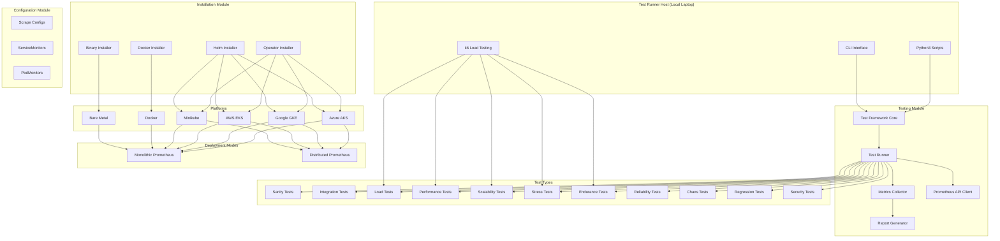

## Directory Structure

```
prometheus/
├── install/                    # Installation Module
│   ├── binary/                 # Binary installation scripts
│   │   ├── install-linux.sh
│   │   ├── install-macos.sh
│   │   ├── install-windows.ps1
│   │   ├── prometheus.yml
│   │   ├── systemd/           # Linux service config
│   │   ├── launchd/           # macOS service config
│   │   └── windows/           # Windows service config
│   ├── docker/                # Docker installation
│   │   ├── docker-compose.yml
│   │   ├── docker-compose.full.yml
│   │   ├── Dockerfile
│   │   └── prometheus.yml
│   ├── helm/                  # Helm installation
│   │   └── kube-prometheus-stack/
│   │       ├── base/
│   │       ├── versions/
│   │       └── environments/
│   └── operator/              # Operator installation
│       ├── olm/
│       ├── openshift/
│       └── prometheus/
├── conf/                      # Configuration Module
│   ├── scrape-configs/
│   │   ├── static/
│   │   ├── file-sd/
│   │   ├── kubernetes/
│   │   ├── exporters/
│   │   └── observability/
│   ├── servicemonitors/
│   └── podmonitors/
├── tests/                     # Testing Module
│   ├── framework/             # Core framework
│   ├── config/                # Test configurations
│   ├── k6/                    # k6 load test scripts
│   ├── sanity/
│   ├── integration/
│   ├── load-tests/
│   ├── stress-tests/
│   ├── performance/
│   ├── scalability/
│   ├── endurance/
│   ├── reliability/
│   ├── chaos/
│   ├── regression/
│   └── security/
└── docs/                      # Documentation
    ├── installation/
    ├── configuration/
    ├── testing/
    └── reference/
```

## Installation Module

### Binary Installation

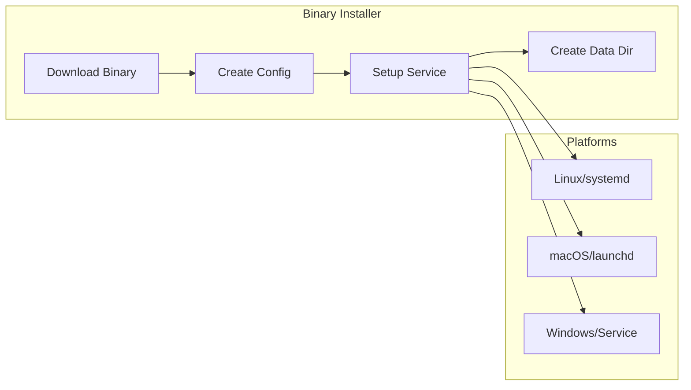

Supports:
- Linux (amd64, arm64, armv7) with systemd
- macOS (amd64, arm64) with launchd
- Windows (amd64) with Windows Service

### Docker Installation

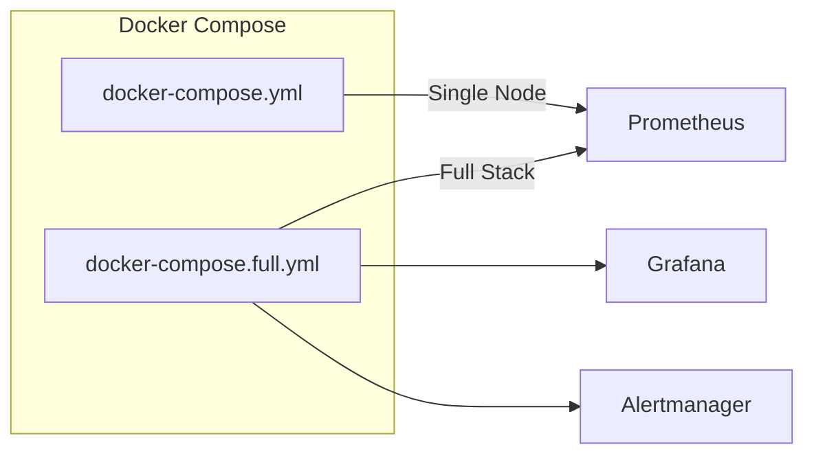

Provides:
- Single-node Prometheus deployment
- Full monitoring stack (Prometheus + Grafana + Alertmanager)
- Custom image builds with baked-in configuration

### Helm Installation

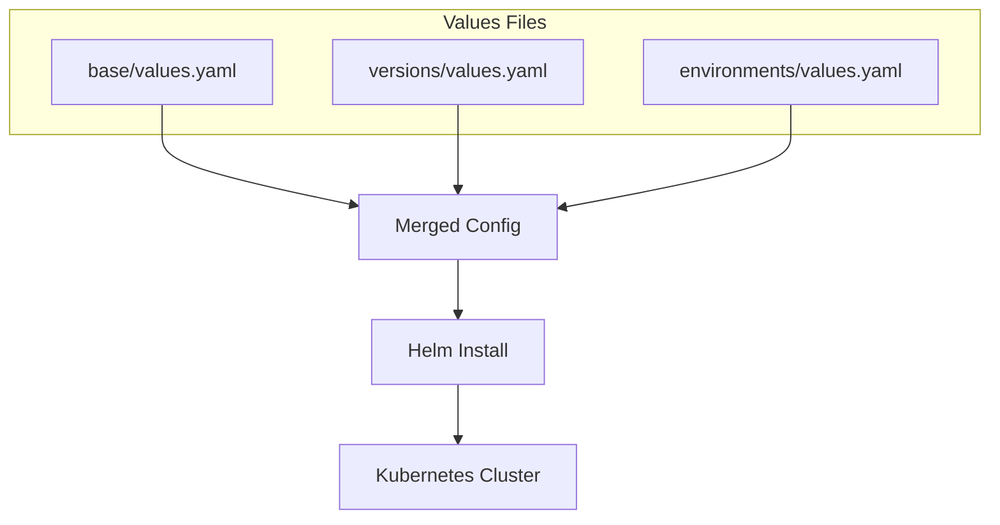

Supports:
- Environment-specific values (dev, staging, prod, minikube)
- Version-specific values (LTS v3.5.0, Latest v3.9.0)
- High availability configuration

### Operator Installation

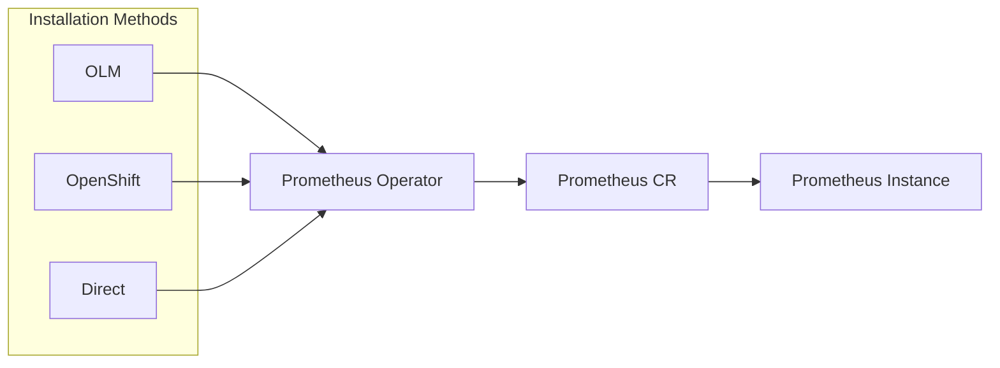

Supports:
- OpenShift OperatorHub
- OLM on vanilla Kubernetes
- Direct bundle installation
- Size templates (demo, small, medium, large)

## Testing Module

### Test Framework Core

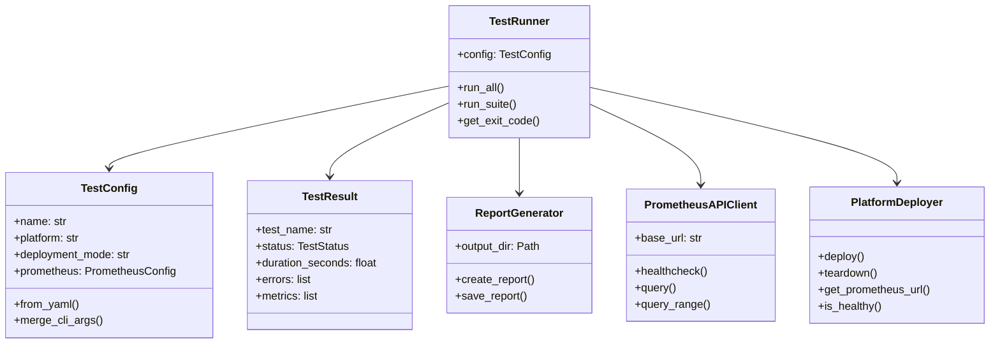

### Platform Deployers

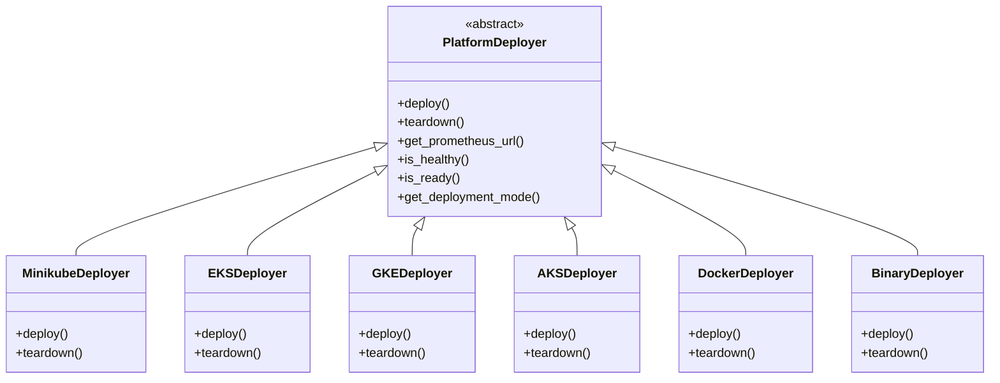

### Test Execution Flow

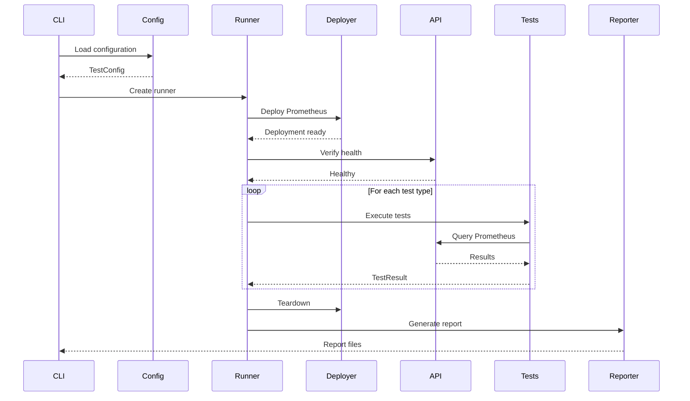

## Deployment Modes

### Monolithic Prometheus

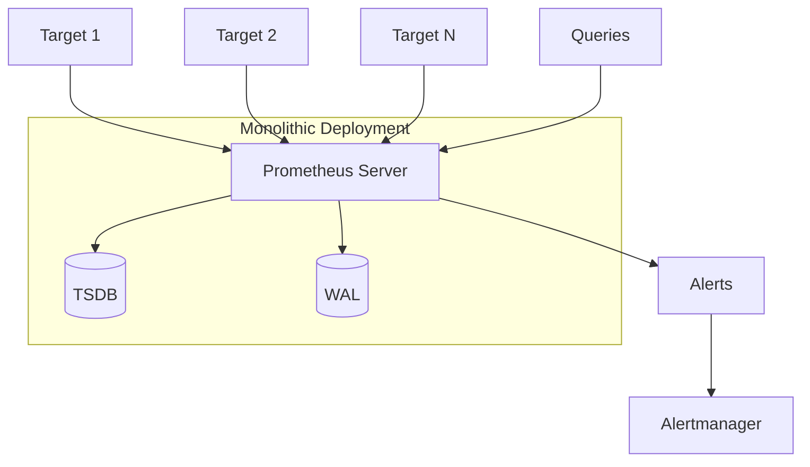

Characteristics:
- Single instance
- Local TSDB storage
- Suitable for: development, small deployments
- Platforms: All (binary, Docker, Kubernetes)

### Distributed Prometheus

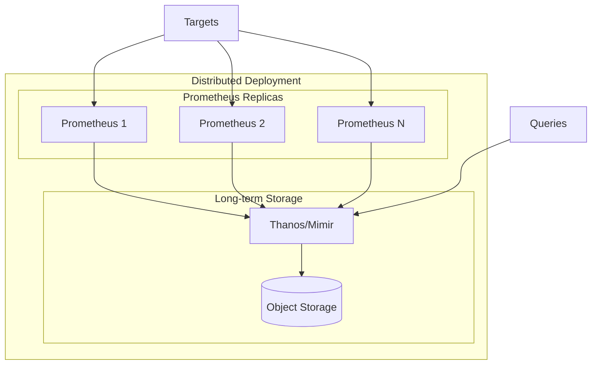

Characteristics:
- Multiple replicas for HA
- Federation or Thanos/Mimir for scaling
- Suitable for: production, large deployments
- Platforms: Kubernetes only (Minikube, EKS, GKE, AKS)

## Test Types Architecture

### Load Testing with k6

```mermaid
flowchart LR
    subgraph "Test Runner Host"
        K6[k6]
        SC[Scripts]
    end

    subgraph "Prometheus"
        API[/api/v1/query]
        RW[/api/v1/write]
    end

    SC --> K6
    K6 --> |HTTP Load| API
    K6 --> |Remote Write| RW
    K6 --> |Metrics| R[Results]
```

k6 scripts:
- `query-load.js` - Query endpoint load testing
- `query-range-load.js` - Range query load testing
- `remote-write-load.js` - Remote write load testing
- `stress-ramp.js` - Stress test ramping
- `scaling.js` - Scalability testing
- `soak.js` - Endurance/soak testing
- `benchmark.js` - Performance benchmarks

### Chaos Testing

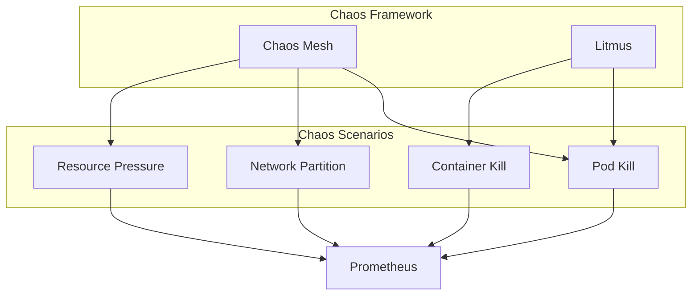

## Data Flow

### Test Results Flow

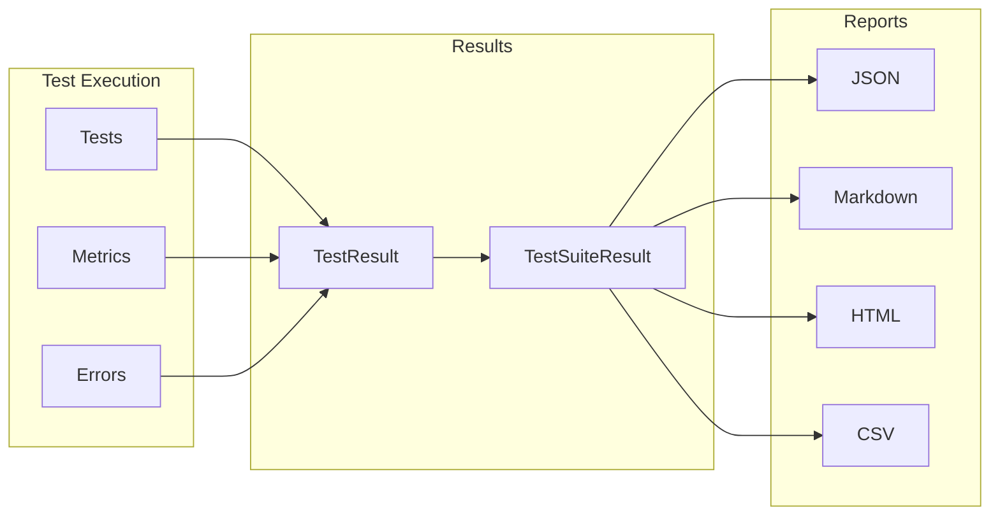

### Configuration Flow

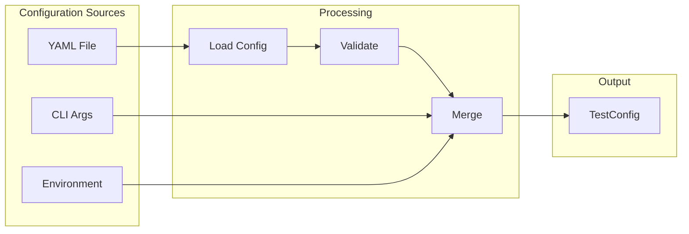

## See Also

- [CLI Reference](cli-reference.md) - Command-line interface reference
- [Configuration Schema](config-schema.md) - YAML configuration reference
- [Glossary](glossary.md) - Terms and definitions
- [Test Types](../testing/test-types.md) - Description of each test type
