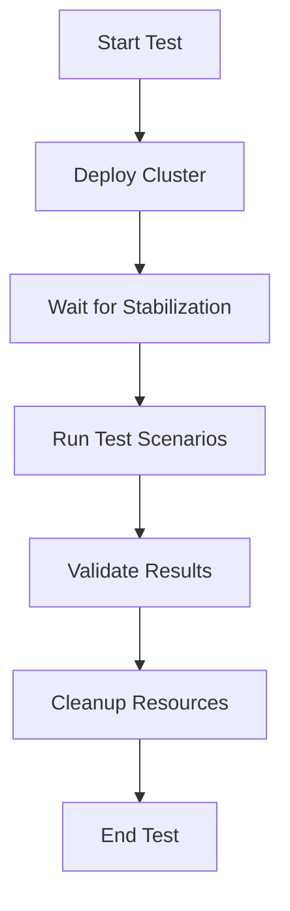

# Integration Test Guide

This guide provides comprehensive information about running and understanding the SkyWalking cluster integration tests.

## Overview

The integration test suite validates the complete SkyWalking cluster deployment across four key areas:

1. **Full Deployment Workflow** - End-to-end deployment validation
2. **Marketplace Features** - General services and Kubernetes monitoring
3. **High Availability** - Failure resilience and recovery
4. **Data Persistence** - Data durability across restarts

## Test Architecture

### Test Structure

```
skywalking/tests/
├── integration_test_full_deployment.py      # Full workflow tests
├── integration_test_marketplace_features.py # Marketplace tests
├── integration_test_high_availability.py    # HA tests
├── integration_test_data_persistence.py     # Persistence tests
├── run-integration-tests.sh                 # Test runner script
├── conftest.py                              # Shared fixtures
└── pytest.ini                               # Pytest configuration
```

### Test Fixtures

All integration tests use shared fixtures defined in `conftest.py`:

- `environment` - Target environment (minikube, eks-dev, eks-prod)
- `scripts_dir` - Path to deployment scripts
- `deployed_cluster` - Deployed cluster with automatic cleanup
- `ingested_data` - Test data for persistence tests

## Running Integration Tests

### Quick Start

```bash
# Navigate to tests directory
cd skywalking/tests

# Run all integration tests on Minikube
./run-integration-tests.sh minikube

# Run specific test suite
./run-integration-tests.sh minikube --test-suite ha

# Run with verbose output
./run-integration-tests.sh minikube --verbose
```

### Using Pytest Directly

```bash
# Run all integration tests
pytest integration_test_*.py -v --environment=minikube

# Run specific test file
pytest integration_test_full_deployment.py -v --environment=minikube

# Run specific test
pytest integration_test_full_deployment.py::TestFullDeploymentWorkflow::test_02_all_components_healthy -v --environment=minikube

# Run with markers
pytest -m integration -v --environment=minikube
```

### Test Suite Options

The test runner supports the following test suites:

| Suite | Description | Duration | Tests |
|-------|-------------|----------|-------|
| `full` | Full deployment workflow | 20-30 min | 7 tests |
| `marketplace` | Marketplace features | 15-25 min | 10 tests |
| `ha` | High availability | 15-20 min | 10 tests |
| `persistence` | Data persistence | 20-30 min | 10 tests |
| `all` | All integration tests | 60-90 min | 37 tests |

### Environment Options

Tests can run against different environments:

- `minikube` - Local Minikube cluster (default)
- `eks-dev` - EKS development environment
- `eks-prod` - EKS production environment

## Test Details

### 1. Full Deployment Workflow Tests

**Purpose:** Validate complete deployment from start to finish

**Test Scenarios:**
1. Deployment completes successfully
2. All components are healthy
3. Connectivity tests pass
4. Data ingestion works
5. Data visible in UI
6. Self-observability metrics visible
7. Deployment is idempotent

**Expected Duration:** 20-30 minutes

**Key Validations:**
- All pods reach Running state
- Health checks pass for all components
- Network connectivity between components
- Data flows through complete pipeline
- UI displays ingested data
- Self-observability metrics collected

### 2. Marketplace Features Tests

**Purpose:** Validate SkyWalking marketplace integrations

**Test Scenarios:**
1. General services monitoring (MySQL, Redis, RabbitMQ)
2. MySQL metrics collection and visibility
3. Redis cache metrics collection
4. RabbitMQ message queue metrics
5. Message queue monitoring (ActiveMQ, RabbitMQ)
6. ActiveMQ metrics collection
7. Kubernetes cluster monitoring
8. OTel Collector configuration
9. Exporter deployment validation
10. Performance within time limits

**Expected Duration:** 15-25 minutes

**Key Validations:**
- Test services deployed successfully
- Exporters configured and running
- OTel Collector scraping metrics
- Metrics visible in SkyWalking UI
- Marketplace features activated
- Tests complete within 10 minutes per feature

### 3. High Availability Tests

**Purpose:** Validate cluster resilience and recovery

**Test Scenarios:**
1. Multiple replicas deployed
2. Pod anti-affinity configured
3. Pod disruption budgets configured
4. Simulate OAP Server pod failure
5. Data ingestion continues after failure
6. UI remains accessible after failure
7. Cluster recovers automatically
8. Rolling update strategy configured
9. No data loss during failure
10. etcd cluster maintains quorum

**Expected Duration:** 15-20 minutes

**Key Validations:**
- At least 2 replicas per component
- Anti-affinity rules prevent co-location
- PDBs limit unavailable pods
- Cluster continues operating during failures
- Automatic pod recreation
- Data ingestion not interrupted
- UI remains accessible
- No data loss

### 4. Data Persistence Tests

**Purpose:** Validate data durability across restarts

**Test Scenarios:**
1. Data ingestion successful
2. PVCs bound to volumes
3. Restart BanyanDB data pods
4. Data queryable after BanyanDB restart
5. Restart OAP Server pods
6. Data queryable after OAP restart
7. Restart all components sequentially
8. Final health check after restarts
9. PVCs remain bound after restarts
10. No data loss after multiple restarts

**Expected Duration:** 20-30 minutes

**Key Validations:**
- Test data ingested successfully
- Persistent volumes bound
- Data survives BanyanDB restarts
- Data survives OAP Server restarts
- Data survives multiple component restarts
- PVCs remain bound throughout
- Cluster recovers to healthy state

## Test Execution Flow

### Standard Test Flow



### Fixture Lifecycle

```python
# Class-scoped fixtures run once per test class
@pytest.fixture(scope="class")
def deployed_cluster(environment, scripts_dir):
    # Setup: Deploy cluster
    deploy_cluster(environment)

    yield environment

    # Teardown: Cleanup cluster
    cleanup_cluster(environment)
```

## Prerequisites

### System Requirements

**Minikube:**
- 6 CPU cores minimum
- 12GB memory minimum
- 50GB disk space minimum
- Docker or VirtualBox

**EKS:**
- EKS cluster with 3+ nodes
- Each node: 4 CPU, 16GB memory
- EBS CSI driver installed
- kubectl configured with EKS credentials

### Software Requirements

- Python 3.8+
- pytest 7.0+
- kubectl 1.24+
- helm 3.0+
- bash 4.0+

### Installation

```bash
# Install Python dependencies
cd skywalking/tests
pip install -r requirements.txt

# Verify kubectl access
kubectl cluster-info

# Verify helm installation
helm version
```

## Troubleshooting

### Common Issues

#### 1. Cluster Not Accessible

**Symptom:** Tests fail with "Cannot connect to Kubernetes cluster"

**Solution:**
```bash
# Check cluster status
kubectl cluster-info

# For Minikube
minikube status
minikube start

# Verify kubectl context
kubectl config current-context
```

#### 2. Deployment Timeout

**Symptom:** Tests fail with "Deployment timeout exceeded"

**Solution:**
- Increase timeout in test fixtures (default: 1200s)
- Check cluster has sufficient resources
- Review pod events: `kubectl describe pod -n skywalking <pod-name>`
- Check pod logs: `kubectl logs -n skywalking <pod-name>`

#### 3. Insufficient Resources

**Symptom:** Pods stuck in Pending state

**Solution:**
```bash
# Check node resources
kubectl top nodes

# Check pod resource requests
kubectl describe pod -n skywalking <pod-name>

# For Minikube, increase resources
minikube stop
minikube start --cpus=6 --memory=12288
```

#### 4. Test Failures After Cleanup

**Symptom:** Tests fail because previous resources not cleaned up

**Solution:**
```bash
# Manual cleanup
kubectl delete namespace skywalking

# Or use cleanup script
cd skywalking/scripts
./cleanup-skywalking-cluster.sh minikube --force --delete-pvcs --delete-namespace
```

#### 5. PVC Binding Failures

**Symptom:** PVCs stuck in Pending state

**Solution:**
```bash
# Check PVC status
kubectl get pvc -n skywalking

# Check storage class
kubectl get storageclass

# For Minikube, ensure default storage class exists
kubectl get storageclass standard
```

### Debug Mode

Run tests with maximum verbosity:

```bash
# Pytest verbose mode
pytest integration_test_*.py -vv -s --environment=minikube

# Test runner verbose mode
./run-integration-tests.sh minikube --verbose

# Show all kubectl commands
export KUBECTL_VERBOSE=1
pytest integration_test_*.py -v --environment=minikube
```

### Collecting Diagnostics

When tests fail, collect diagnostic information:

```bash
# Get all pods
kubectl get pods -n skywalking -o wide

# Get pod logs
kubectl logs -n skywalking <pod-name> --previous

# Get pod events
kubectl get events -n skywalking --sort-by='.lastTimestamp'

# Get cluster info
kubectl cluster-info dump > cluster-dump.txt

# Get resource usage
kubectl top nodes
kubectl top pods -n skywalking
```

## Best Practices

### Running Tests Locally

1. **Start with property-based tests** - Fast validation of configurations
2. **Run single integration test** - Validate one area at a time
3. **Use verbose mode** - See detailed output during development
4. **Clean up between runs** - Ensure clean state for each test

### Running Tests in CI/CD

1. **Use dedicated test cluster** - Avoid interference with other workloads
2. **Run tests sequentially** - Avoid resource contention
3. **Set appropriate timeouts** - Account for CI/CD environment performance
4. **Collect artifacts on failure** - Save logs and diagnostics
5. **Clean up after tests** - Remove test resources

### Test Development

1. **Follow existing patterns** - Use shared fixtures and utilities
2. **Add appropriate markers** - Tag tests with @pytest.mark.integration
3. **Document test purpose** - Clear docstrings explaining what's tested
4. **Validate requirements** - Reference specific requirements in docstrings
5. **Handle cleanup** - Use fixtures for automatic resource cleanup

## Performance Optimization

### Reducing Test Time

1. **Run specific test suites** - Only run what you need
2. **Use parallel execution** - Run independent tests in parallel
3. **Reduce stabilization waits** - Adjust wait times based on environment
4. **Skip optional tests** - Focus on critical path

### Resource Optimization

1. **Use Minikube for development** - Faster and cheaper than cloud
2. **Scale down replicas** - Use minimum viable configuration
3. **Reduce retention periods** - Shorter data retention for tests
4. **Clean up promptly** - Remove resources immediately after tests

## CI/CD Integration

### GitHub Actions Example

```yaml
name: Integration Tests

on:
  pull_request:
    branches: [main]
  schedule:
    - cron: '0 2 * * *'  # Run nightly

jobs:
  integration-tests:
    runs-on: ubuntu-latest
    steps:
      - uses: actions/checkout@v3

      - name: Setup Minikube
        uses: medyagh/setup-minikube@latest
        with:
          cpus: 6
          memory: 12288

      - name: Setup Python
        uses: actions/setup-python@v4
        with:
          python-version: '3.11'

      - name: Install dependencies
        run: |
          cd skywalking/tests
          pip install -r requirements.txt

      - name: Run integration tests
        run: |
          cd skywalking/tests
          ./run-integration-tests.sh minikube --test-suite all

      - name: Collect logs on failure
        if: failure()
        run: |
          kubectl get pods -n skywalking -o wide
          kubectl logs -n skywalking --all-containers=true

      - name: Cleanup
        if: always()
        run: |
          cd skywalking/scripts
          ./cleanup-skywalking-cluster.sh minikube --force --delete-pvcs --delete-namespace
```

## References

- [SkyWalking Documentation](https://skywalking.apache.org/docs/)
- [Pytest Documentation](https://docs.pytest.org/)
- [Kubernetes Testing Guide](https://kubernetes.io/docs/tasks/debug/)
- [Integration Testing Best Practices](https://martinfowler.com/articles/practical-test-pyramid.html)

## Support

For issues or questions:

1. Check this guide for troubleshooting steps
2. Review test output and logs
3. Check SkyWalking documentation
4. Open an issue with diagnostic information
